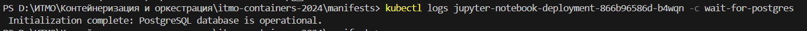
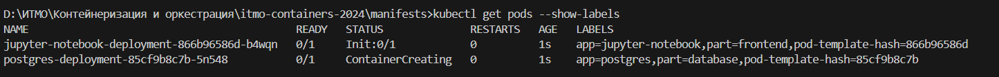
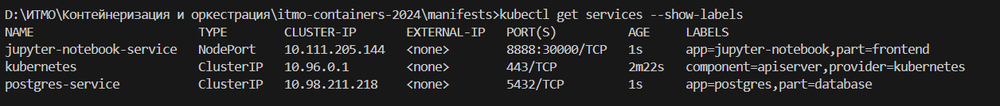
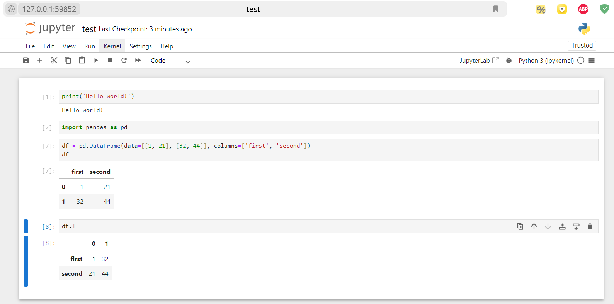

# Отчет по проделанной лабораторной работе №4

#### Ход выполнения
1. Запускаем minikube-кластер.
```bash
minikube start
```

2. Собираем docker-образ `my_jupyter_notebook` Dockerfile из текущей директории.
```bash
minikube image build -t my_jupyter_notebook .
```

3. Запускаем все манифесты.
```bash
kubectl apply -f configmap.yml
kubectl apply -f pg_secret.yml
kubectl apply -f pg_pvc.yml
kubectl apply -f jupyter_deployment.yml
kubectl apply -f pg_deployment.yml
kubectl apply -f pg_service.yml
kubectl apply -f jupyter_service.yml
```

Проверяем, что оба пода создались.
```bash
kubectl get pods
```

Проверяем логи этих подов.
```bash
kubectl logs <имя_пода>
```

Проверяем конфигурации и секреты.
```bash
kubectl get configmaps
kubectl get secrets
```

4. Запускаем сервис и проверяем доступ к нему.
```bash
minikube service jupyter-notebook-service --url
```


## Проверяем статусы
Проверка логов init-контейнера:
```bash
kubectl logs <pod_name> -c wait-for-postgres
```



Получение списка всех подов с метками:
```bash
kubectl get pods --show-labels
```


## Проверяем сервисы
```bash
kubectl get services --show-labels
```



## Проверяем работу jupyter-notebook
